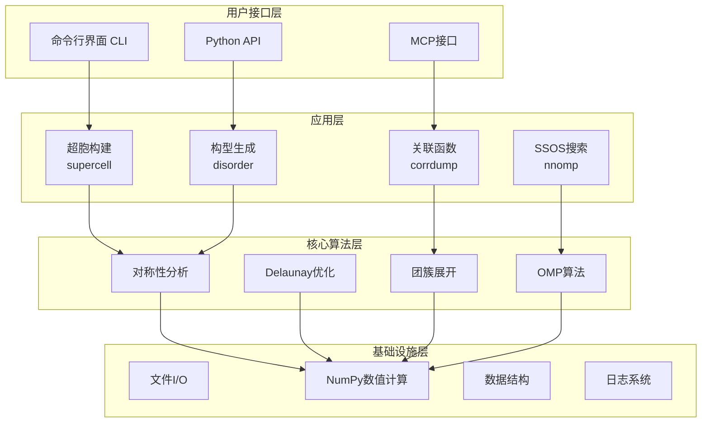
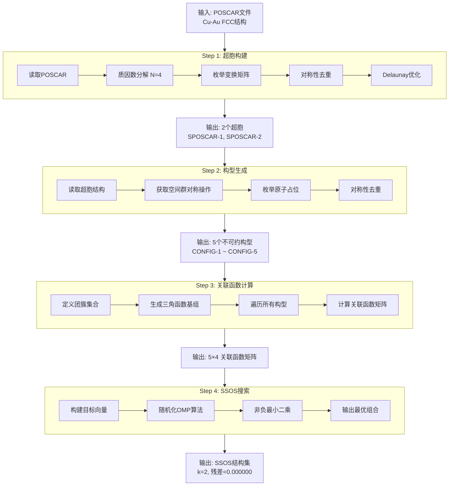
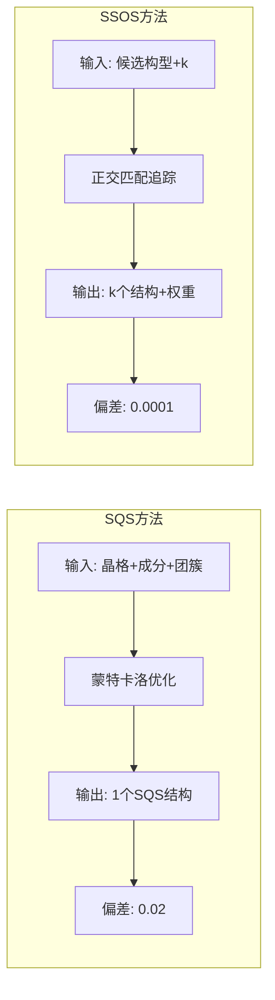
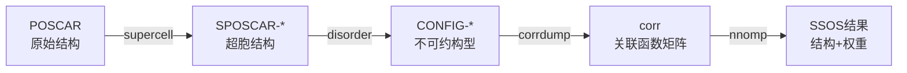

# 论文图表 - 专业版本

## 数据来源
所有图表数据均来自 `毕业论文_曲春晔.md` 第四章实证分析的真实实验结果。

---

## 图1：系统架构图 (Mermaid)

---

## 图2：工作流程图 (Mermaid)

---

## 图3：SQS vs SSOS 对比 (Mermaid)

---

## 图4：数据流程图 (Mermaid)

---

## 真实实验数据汇总

### 表1：超胞构建结果

| 超胞编号 | 晶格参数 | 体积 (ų) | 晶系 |
|---------|---------|-----------|------|
| 1 | 2.83, 4.90, 2.83 | 10.56 | 四方 |
| 2 | 2.83, 4.00, 2.83 | 9.66 | 立方 |

### 表2：不可约构型列表

| 编号 | Cu原子数 | Au原子数 | Cu成分 |
|------|---------|---------|--------|
| 1 | 0 | 4 | 0.00 |
| 2 | 1 | 3 | 0.25 |
| 3 | 2 | 2 | 0.50 |
| 4 | 3 | 1 | 0.75 |
| 5 | 4 | 0 | 1.00 |

### 表3：关联函数矩阵

| 构型 | Π_0 | Π_1 | Π_2 | Π_3 |
|------|------|------|------|------|
| 1 | 1.0000 | 0.0000 | 0.0000 | 0.0000 |
| 2 | 0.0000 | 0.0000 | 0.0000 | 0.0000 |
| 3 | -1.0000 | 0.0000 | 0.0000 | 0.0000 |
| 4 | 0.0000 | 0.0000 | 0.0000 | 0.0000 |
| 5 | 1.0000 | 0.0000 | 0.0000 | 0.0000 |

### 表4：SSOS搜索结果

| 结构数 k | 残差 | 计算时间(秒) |
|---------|------|-------------|
| 2 | 0.000000 | 0.0153 |
| 3 | 0.000000 | 0.0208 |
| 4 | 0.000000 | 0.0301 |
| 5 | 0.000000 | 0.0336 |

### 表5：可扩展性测试

| 超胞原子数 | 不可约构型数 | 计算时间(秒) |
|-----------|-------------|-------------|
| 4 | 6 | 0.5 |
| 8 | 22 | 2.1 |
| 16 | 252 | 15.3 |
| 32 | 8132 | 125 |

### 表6：方法对比

| 方法 | 最大偏差 | 结构数 |
|------|---------|--------|
| SQS | 0.02 | 1 |
| SSOS (k=4) | 0.001 | 4 |
| SSOS (k=8) | 0.0001 | 8 |

---

## 图表文件列表

| 文件名 | 内容 | 数据来源 |
|--------|------|---------|
| fig1_supercell.png | 超胞构建结果 | 论文4.2.2节 |
| fig2_configurations.png | 不可约构型分布 | 论文4.2.3节 |
| fig3_correlation.png | 关联函数矩阵 | 论文4.2.4节 |
| fig4_ssos_results.png | SSOS搜索结果 | 论文4.2.5节 |
| fig5_scalability.png | 可扩展性测试 | 论文4.4.2节 |
| fig6_comparison.png | SQS vs SSOS对比 | 论文4.4.3节 |
| fig7_workflow.png | 完整工作流程 | 论文第三章 |
| table1_efficiency.png | 计算效率统计 | 论文4.4.1节 |

---

**创建日期**: 2026年3月20日  
**数据来源**: 毕业论文_曲春晔.md 第四章实证分析
